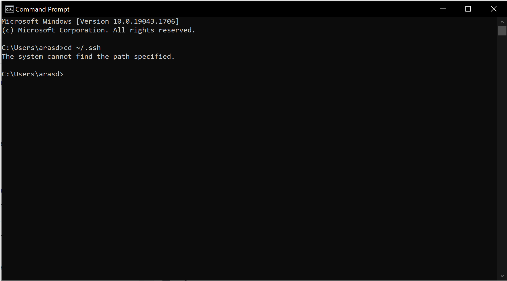
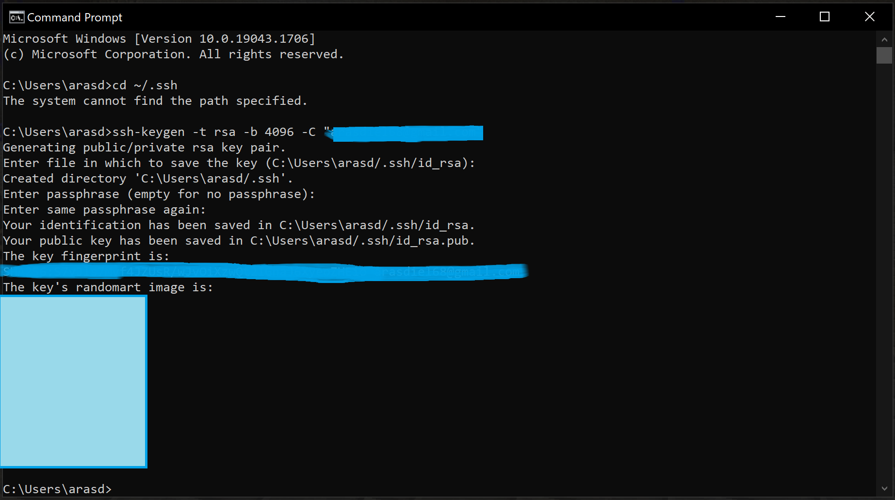
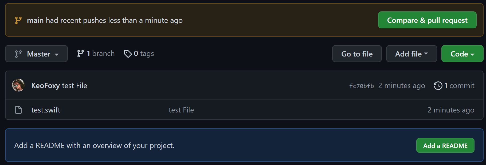
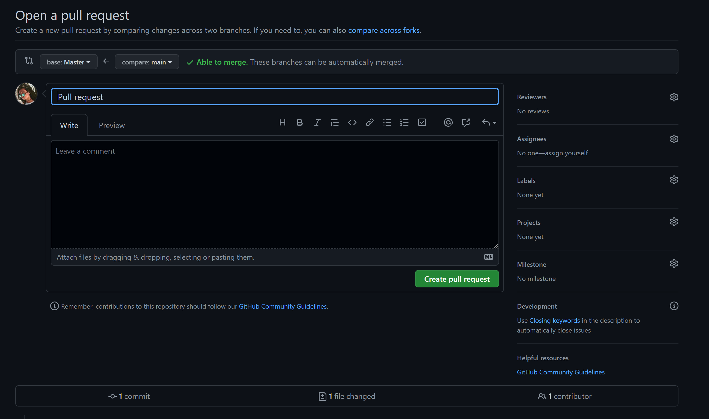

# Dillinger
## _Инструкция по использованию GIT_
[Список основных команд](#список-основных-команд)
### Установка GIT
Для начала нам необходимо уставноить сам Git на устройство. Сделать этом можно на [официальном сайте](https://git-scm.com/download/win). Рекомендуется использовать VPN при скачивании, тк может быть очень низкая скорость загрузки для российских пользователей.
Для пользователей **MacOS** установка выполняется через терминал следующим образом (необходимо иметь менеджер пакетов [brew](https://brew.sh/index_ru)):  
`$ brew install git`  
Для пользователей **Linux** существует несколько способов:  
* `apt-get install git` для Debian/Ubuntu
* `yum install git` Fedora 21 или ранее
* `dnf install git` Fedora 22+

Чтобы проверить, установлен ли Git на вашем устройстве — необходимо открыть терминал и прописать `git --version`. Если все успешно, то терминал выведет вам версию вашего Git'a.

### Настройка Git

После установки Git необходимо его настроить.  
Открываем терминал и вводим команду:  
`git config --global user.name "Ник"`.  *Пример `git config --global user.name "ZeroTwoTopWaifu"`*  
Следующая команда:  
`git config --global user.email адрес`.  *Пример `git config --global user.email VT_Plis@gmail.com`*  

Обратите внимание, что в командах, указанных выше, есть опция `--global`. Это значит, что такие данные будут сохранены для всех ваших действий в Git и вводить их больше не надо. Если вы хотите менять эту информацию для разных проектов, то в директории проекта вводите эти же команды, только без опции `--global`.

### Регистрация на GitHub

Переходим на [сайт Github](https://github.com/) и регистрируемся. Не забудьте подтверlить почту.  
Поздравляю! Теперь у Вас есть аккаунт на GitHub. После регистрации и подтверждения почты, гитхаб сам предложит создать репозиторий. 

### Конфигурация SSH-ключей

Что такое **SSH-ключ** и зачем он нужен?  

Чтобы работать со своего компьютера с GitHub, иметь доступ к проектам, хранящимся на сервисе, выполнять команды в консоли без постоянного подтверждения пароля, нужно пройти авторизацию у сервера. В этом помогают SSH-ключи.  

Каждый SSH-ключ содержит пару: открытый (публичный) и закрытый (приватный) ключ. Открытый ключ отправляется на сервер, его можно не прятать от всех и не переживать, что кто-то его увидит и украдёт. Он бесполезен без своей пары — закрытого ключа. А вот закрытый ключ — секретная часть. Доступ к нему должен быть только у вас.  

Вы отправляете какую-то информацию на сервер, где хранится ваш публичный ключ, сервер понимает, что вы это вы, то есть идентифицирует именно вас, и даёт вам какой-то ответ. И только вы можете расшифровать этот ответ, потому что только у вас есть подходящий закрытый ключ. Получается что-то вроде связки логин-пароль только намного безопасней. Ваш пароль кто-то может узнать или подобрать, а чтобы получить ваш приватный SSH-ключ, злоумышленнику придётся взломать ваш компьютер.  

Чтобы пройти авторизацию по SSH-ключу, его надо сгенерировать или найти уже ранее созданный ключ на своём компьютере.  

После небольшой теории приступаем к практике.  
P.S В данной инструкции в командах будет присутствовать название файла **id_rsa**, у вас название этого файла может быть другим. 
1. Первым делом проверим наличие на компьютере ключа. Ключи хранятся в каталоге `~/.ssh`, поэтому проверим содержимое каталога.
2. Открываем консоль и вводим `cd ~/.ssh`. Мы попадаем в каталог. Далее прописываем `ls`, чтобы увидеть все файлы внутри.
Если ключи уже имеются на устройстве, то мы увидим несколько файлов, среди которых будут `name` `name.pub`. Они могут называется по-разному — `id_rsa`, `id_dsa`,`id_ecdsa`,`id_ed25519`. Файл с расширением `.pub` — публичный ключ, второй — привытный.

Если у вас нет таких файлов или вообще нет директории `.ssh`, то их необходимо сгенерировать.  

  
  
Открываем консоль и вводим команду:  

`ssh-keygen -t rsa -b 4096 -C "your_mail@example.com"`  *— Здесь необходимо указать ту почту, которую использовали для регистрации на GitHub.*  

  

Далее вас попросят указать расположения директории для сохранения ключа. Можете ввести путь к своей директории или нажать `Enter` и файл сохранится по адресу, указанному в скобках.  

После вас попросят дважды ввести пароль к ключу. Если не хотите вводить пароль каждый раз, когда используете ключ, пропустите этот шаг, нажав `Enter`, и ничего не вводите.  

Теперь у вас сгенерирован ключ по указанному выше адресу.  

  

Добавляем ключ в `ssh-agent`(сгенерированный или уже существующий). Проверяем доступность ключа командой:   
`eval "$(ssh-agent -s)"`  

Если на Windows возникают проблемы, то используйте команду: `start-ssh-agent`, если и это не помогло, то используйте **Git Bash**.  

Добавляем ключ `ssh-add ~/.ssh/Имя ключа` *Пример `ssh-add ~/.ssh/id_rsa`*  

**Несколько важный примечаний:**
- Если вы захотите переименовать ключ, то могут возникнуть проблемы. Решаются с помощью связи ключа с доменом. `~/.ssh/config`  
- Если у вас MacOS Sierra версии 10.12.2 и выше, нужно изменить ваш `~/.ssh/config` файл, чтобы автоматически загрузить ключи в ssh-agent и хранить пароли  
```
Host *
 AddKeysToAgent yes
 UseKeychain yes
 IdentityFile ~/.ssh/id_rsa
 ```
 Вы можете добавить свой приватный ключ в **ssh-agent** и сохранить пароль к нему с помощью команды `ssh-add -K ~/.ssh/id_rsa`. Если у вашего ключа другое имя, не забудьте заменить **id_rsa** в команде на правильное название.  
 - Если у вас Linux, может понадобится переназначить для **~/.ssh** права доступа командой `chmod 700 ~/.ssh/`.   

После того, как мы создали ключ, его необходимо добавить на **GitHub**.  
Скопировать ключ можно разными методами:  
Самый простой: открыть файл **id_rsa** через блокнот или Notepad++ и скопировать содержимое.  
Или используя команды:  
- Windows: `clip`
- MacOS: `pbcopy`
- На Linux используйте `sudo apt-get install xclip`, чтобы установить пакет **xclip**, а затем введите `cat ~/.ssh/id_rsa.pub` (или какое там у вас название файла.) Содержимое файла появится в консоли и вы сможете его оттуда скопировать.

**После того, как мы скопировали ключ**

Переходим на [страницу для работы с ключами](https://github.com/settings/keys) в вашем профиле на GitHub.  
Нажимаем кнопку New SSH key(Новый SSH ключ). Вводим название для ключа(Абсолютно любое название) в поле Title, ниже вставляем наш ключ из файла. Добавляем ключ. Вводим пароль от учетной записи и после у вас в списке появится ключ.  
Поздравляю! Настройка завершена.  


### Работа с репозиториями
После создания репозитория на гитхабе его необходимо клонировать себе на устройство. Предварительно необходимо перейти в директорию, где вы хотите хранить этот репозиторий (В консоли: `cd 'Путь или название папки'` или используйте **GitBash** в нужной папке.   
Клонируем репозиторий с помощью команды:  
`git clone git@github.com:NickName/your-repository.git` *Пример `git clone git@github.com:KeoFoxy/test_git.git`*  

**В GitBash не работает стандартное ctrl+c ctrl+v, используйте shift+insert.**  

Если вдруг появилось сообщение об ошибке `Error: Permission denied (publickey)`, то значит, что вы что-то сделали не так, вернитесь к инструкции выше и попробуйте заново.  

Если хотите, чтобы название папки с репозиторием отличалось от имени репозитория, то используйте:  
`git clone git@github.com:_your-nickname_/_your-project_.git folder_name`  

После клонирования репозитория необходимо попасть в его директорию. В начале командной строки в консоли у вас указывается адрес, где вы сейчас находитесь.  

При работе над проектом используют ветки. У репозитория есть по умолчанию одна ветка **main**, в ней хранится основная рабочая версия проекта. Чтобы исправить что-то или добавить и не сломать код, добавьте ветку в проект. В новую ветку скопирются все файлы и вы можете спокойно делать с ними все, что угодно.  

Чтобы узнать состояние ветки, используйте команду: `git status`  
Она покажет текущее состояние в вашей ветке, а именно список с названиями изменённых файлов, если они есть, и укажет на те, которые ожидают записи и сохранения (обычно они выделены красным цветом).  
Перед тем, как зафиксировать изменения отдельных файлов, нужно добавить файлы в набор этих изменений. Воспользуйтесь командой `git add имя-файла`  
Если вы хотите сохранить все изменения разом, вводите `git add -A`  

После добавления файла, мы можем сделать коммит, зафиксировать изменения и написать комментарий к ним:  
`git commit -m "Ваше сообщение"`  
Пишите осмысленные комментарии к коммитам, что вы сделали в этом изменении и тд.  

После того, как коммит сделан, можно отправлять наши изменения в репозиторий на GitHub:  
`git push origin название-текущей-ветки` *Пример `git push origin Master`*  

Готово! Наши изменения улетели в ветку Master и теперь они находятся в репозитории на GitHub!  

Теперь рассмотрим такую вещь, как **Pull Request**.

  

Когда вы или ваш коллега закончите работу в новой ветке, не основной, и отправите изменения на ГитХаб, то будет создан запрос на слияние, где администратор репозитория может его рассмотреть и принять или отклонить изменения. Если изменения устраивают, то необходимо сделать **Merge** веток, то есть слиять их.   

   

Любое предложение можно принять или отвергнуть. Так же и с пулреквестом. После его создания, он должен получить ревью и одобрение так называемого коллаборатора — пользователя GitHub, который имеет права администратора в мастер-репозитории. Им может быть ваш коллега-разработчик, техлид, наставник. Если к вашему коду нет вопросов, пулреквест принимается и изменения из вашей ветки попадают в `main` главного репозитория. Если в код нужно внести изменения, пулреквест отклоняется, и вам нужно снова пройти по цепочке локальные изменения — сохранение — коммит — пуш, только пулреквест заново делать не нужно. Если вы продолжаете вести работу в той же ветке и пулреквест ещё не принят, все ваши изменения автоматически добавятся в пулреквест, созданный из этой ветки после команды `git push origin название-текущей-ветки`  

Pull Request показывает, что изменилось в новой ветке, по сравнению с основной, если нет никаких конфликтов, то вы спокойно можете делать слияние.  

Теперь рассмотрим случай, когда необходимо обновить ваш репозиторий до актуального. Ведь кто-то мог также параллельно работать с репозиторием и вносить изменения, а у вас их нету. Для этого используем команду:  
`git pull название_репозитория Название ветки` *Пример `git pull test_git Master`*  
Если выскакивает ошибка, то используйте:   
`git remote add название_репозитория git@github.com:your-repo.git` 
а затем снова  
`git pull название_репозитория Название ветки`   
*Пример `git pull test_git git@github.com:KeoFoxy/test_git.git`*  

Готово! Теперь ваша копия и оригинальный репозиторий находятся в актуальном состоянии.  

### Список основных команд:  
`cd имя-папки-или-путь` - попасть в директорию по адресу или названию
`git clone git@github.com:your-nickname/your-project.git` - Клонировать репозиторий   
`git checkout -b имя-новой-ветки` - Создать новую ветку  
`git checkout название_ветки` - Переключиться на ветку  
`git branch -m старое-имя-ветки новое-имя-ветки` - Сменить название ветки  
`git status` - проверить статус ветки  
`git add -A` - добавить все файлы в изменения  
`git add имя-файла` - добавить файл в изменения  
`git commit -m "Ваше сообщение"` - создать коммит  
`git push origin название-текущей-ветки` - отправить изменения в репозитория на GitHub  
`git pull название-репозитория название ветки` - синхронизировать ваши файлы на устройстве с репозиторием на GitHub  
`git remote add название-репозитория git@github.com:your-repo.git` - добавить ссылку на репозиторий  
