# Git Guide  
### _Статьи и руководства по работе с Git_  
[**Статья по Git на Habr**](https://habr.com/ru/post/273897/)  
[**Статья по Git на HTML-Academy**](https://htmlacademy.ru/blog/useful/git/git-console)  
[**Git и GitHub Курс для Новичков**](https://youtu.be/zZBiln_2FhM)

## _Инструкция по использованию GIT_  
[**Список основных команд**](#список-основных-команд)  
[**Если вдруг что-то непонятно, то вам сюда — FAQ**](#faq)  
### Установка Git  
Для начала нам необходимо уставноить сам Git на устройство. Сделать этом можно на [официальном сайте](https://git-scm.com/download/win). Рекомендуется использовать VPN при скачивании, тк может быть очень низкая скорость загрузки для российских пользователей.
Для пользователей **MacOS** установка выполняется через терминал следующим образом (необходимо иметь менеджер пакетов [brew](https://brew.sh/index_ru)):  
`$ brew install git`  

### **Настройка Git**  

После установки Git необходимо его настроить — указать ваше имя и адрес электронной почты. Это важно, потому что каждый коммит в Git содержит эту информацию, и она включена в коммиты, передаваемые вами, и не может быть далее изменена  
Открываем [терминал](#как-открыть-терминал) и вводим команду:  

`git config --global user.name "Ник"`.  *Пример: `git config --global user.name "ZeroTwoTopWaifu"`*  
Следующая команда:  

`git config --global user.email почта`.  *Пример: `git config --global user.email VT_Plis@gmail.com`*  

### **Регистрация на GitHub**  

Переходим на [сайт Github](https://github.com/) и регистрируемся. Не забудьте подтвердить почту.  
Поздравляю! Теперь у Вас есть аккаунт на GitHub.

### **SSH-Ключ**  
Как настроить **SSH-ключ** вы можете прочитать в [**этой статье**](https://htmlacademy.ru/blog/useful/git/git-console) или в [**этой**](https://www.atlassian.com/git/tutorials/git-ssh), на крайний случай вам может помочь [**официальная документация GitHub**](https://docs.github.com/en/authentication/connecting-to-github-with-ssh/generating-a-new-ssh-key-and-adding-it-to-the-ssh-agent).  Рекомендую выполнять эти действия в [**GitBash**](#gitbash)

### **Работа с репозиториями**  
После того, как мы установили гит, настроили его и зарегестрировались на GitHub, можно приступать к работе.  
Объяснять буду на примере работы с лабораторными работами по ПЛИС.  Список всех команд и их описание можно найти тут — [**Список основных команд**](#список-основных-команд)  
1. Создаем репозиторий на GitHub.  
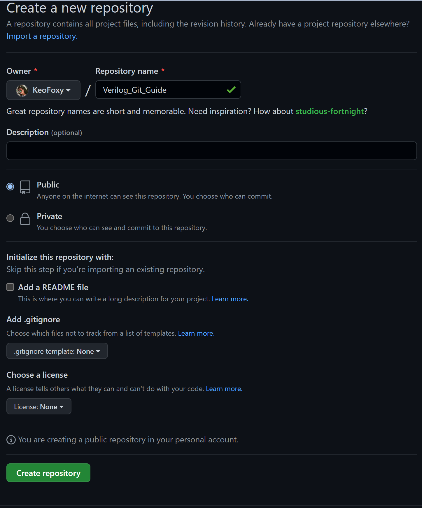  
2. После создания репозитория нам необходимо клонировать его себе на устройство. В вверху мы видим два варианта, как это сделать. Так как мы работаем через консоль, то скопируем ссылку.  
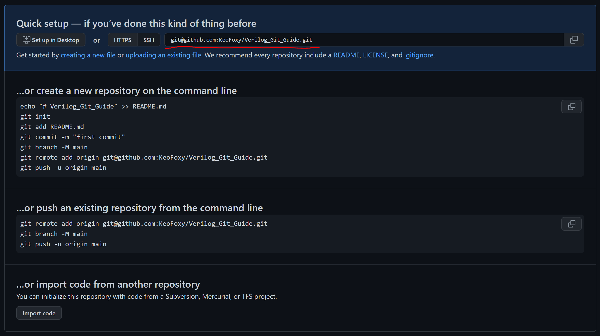  
3. * Переходим в нужную директорию, где будем хранить репозиторий.
   * Просто тыкаем вот сюда и пишем cmd. У вас откроется терминал и вы сразу будете находится в этой папке. Или нажимаем **ПКМ** внутри папки и выбираем **Git Bash Here**. Если вы хотите сами переходить в другие папки внутри терминала, то смотрите инструкцию [здесь](#переход-в-папки)  
   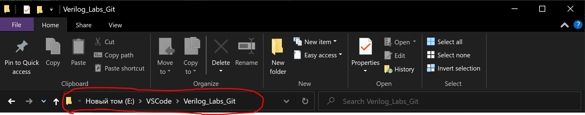
   * Теперь клонируем репозиторий: 
    `git clone git@github.com:NickName/your-repository.git`   
    ***Пример:** `git clone git@github.com:KeoFoxy/Verilog_Git_Guide.git`*  
    Готово! Мы клонировали наш репозиторий.
    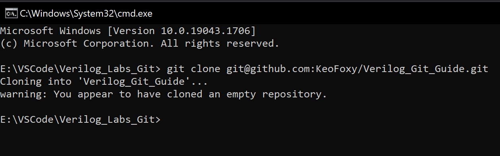  
    Теперь необходимо перейти внутрь папки с самим репозиторием. Повторяем действия выше. Заходим в папку, в строке адреса пишем cmd или ПКМ Git Bash Here или cd название папки.
4. После этого вы начали выполнять лабораторную работу или еще что-то. У вас появились файлы. Пора сделать [**commit**](#commit), а затем отправить его в репозиторий.
5. Первым делом нам надо добавить файлы для коммита. Это делается командой:  
   `git add имя-файла`  
   или можно добавить сразу все файлы и папки  
   `git add -A`  
6. Отлично, файлы добавлены, можно делать коммит.
   `git commit -m "Ваше сообщение"`  
   К каждому коммиту необходимо написать сообщение, в котором содержиться информация, что вы изменили, добавили или убрали, чтобы вам же потом было понятно и проще найти изменения по сообщению к коммиту.
   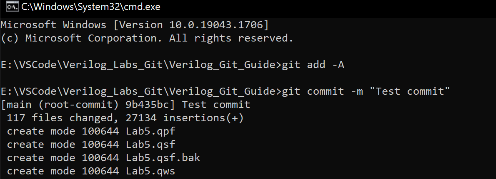  
   Готово, коммит сделан, самое время отправить его на GitHub!
7. Чтобы отправить наш коммит на гитхаб пишем команду:
   `git push origin название-текущей-ветки`  
   ***Пример** `git push origin main`*  
      По умолчанию создается ветка main. Создать новую ветку можно командой:  
   `git checkout -b имя-новой-ветки`  
   Чтобы переключиться на другую ветку:  
   `git checkout название-ветки`  
   Готово! Наши файлы оказались на GitHub!  
   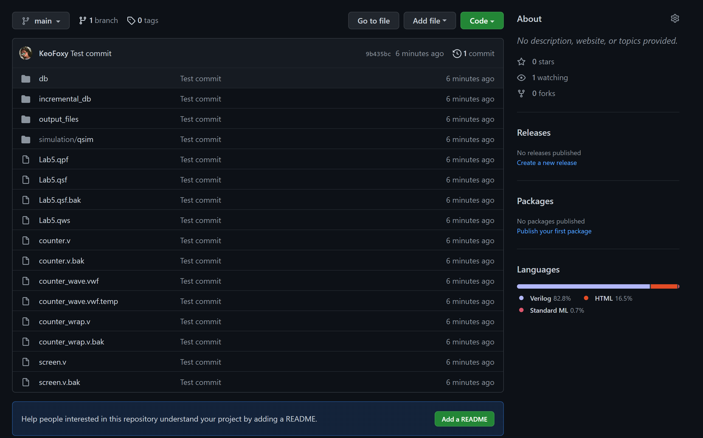  
8. Мы видим, что в репозитории у нас оказались абсолютно все файлы, есть куча мусора, которую Quartus II создает автоматически. Чтобы система Git отслеживала только нужные нам файлы, необходимо лишние добавить в **gitignore**. Это файл, который хранит расширения. Файлы с этими расширениями не будут отслеживаться и попадать в коммиты.  
   **gitignore** можно настроить в ручную. Создаете файл **.gitignore** в папке проекта и в любом редакторе кода заполняете его.  
   Для работ с **Quartus** можно использовать уже готовый [**файл gitignore**](https://gist.github.com/nhasbun/71918796044b7ba89d6662133495f754).  Просто скачиваете его и добавляете в папку с проектом.  
   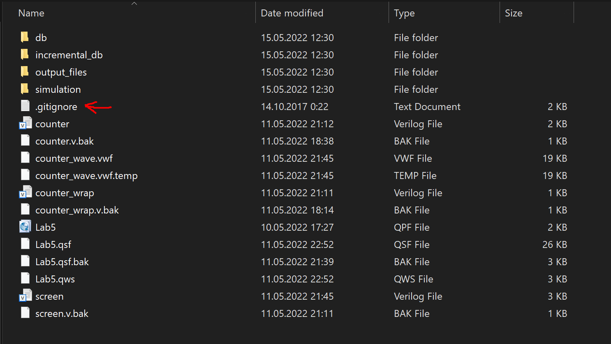  
   Теперь зальем наши файлы в репозиторий, но уже с **gitignore**. Процесс никак не будет отличаться.    
   Готово! Согласитесь, ведь так выглядит гораздо лучше :)
   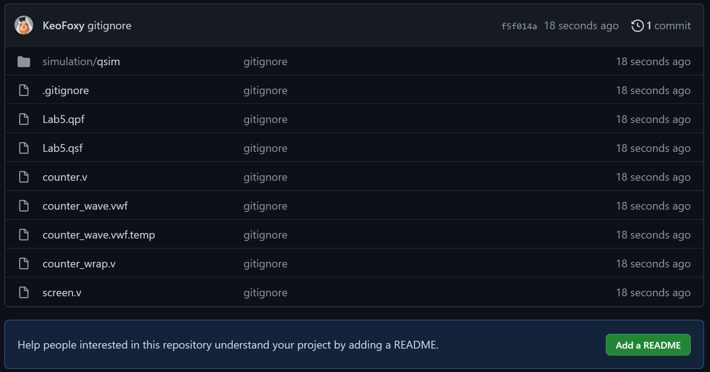  
   Для простоты добавления файлов в gitignore можно использовать GitHub Desktop. Что это такое и как работает можно почитать [**тут**](https://htmlacademy.ru/blog/articles/github-desktop). 
9.  Теперь рассмотрим случай, когда необходимо обновить ваш репозиторий до актуального. Ведь кто-то мог также параллельно работать с репозиторием и вносить изменения, а у вас их нету. Для этого используем команду:  
git pull название_репозитория Название ветки Пример git pull test_git Master  
Если выскакивает ошибка, то используйте:  
`git remote add название_репозитория git@github.com:your-repo.git`  
а затем снова  
`git pull название_репозитория Название ветки`  
***Пример** `git pull test_git git@github.com:KeoFoxy/test_git.git`*  
**Готово!** Теперь ваша копия и оригинальный репозиторий находятся в актуальном состоянии.

## **_Список основных команд:_**   
`git clone git@github.com:your-nickname/your-project.git` - Клонировать репозиторий   
`git checkout -b имя-новой-ветки` - Создать новую ветку  
`git checkout название_ветки` - Переключиться на ветку  
`git branch -m старое-имя-ветки новое-имя-ветки` - Сменить название ветки  
`git status` - проверить статус ветки  
`git add -A` - добавить все файлы в изменения  
`git add имя-файла` - добавить файл в изменения  
`git commit -m "Ваше сообщение"` - создать коммит  
`git push origin название-текущей-ветки` - отправить изменения в репозитория на GitHub. **origin** в данном случае ваш репозиторий.   
`git pull название-репозитория название ветки` - синхронизировать ваши файлы на устройстве с репозиторием на GitHub  
`git remote add название-репозитория git@github.com:your-repo.git` - добавить ссылку на репозиторий  

## _**FAQ**_
#
### **_Как открыть терминал_**
Windows: **Windows + R**. В появившемся окошке пишем ***cmd*** и нажимаем Enter.  
MacOS: **command + space**. В spotlight пишем **terminal**.
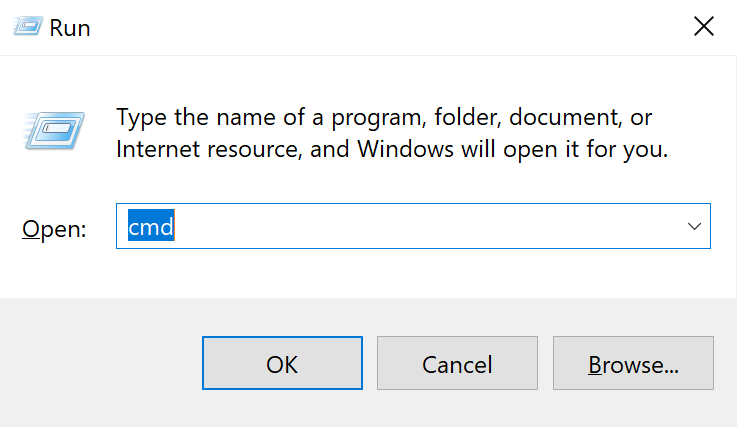  
#
### **_GitBash_**
**GitBash** - аналог стандартного терминала от Git. Вызвать его можно нажав **ПКМ** в нужном вам месте  
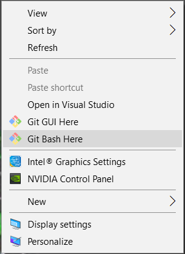  
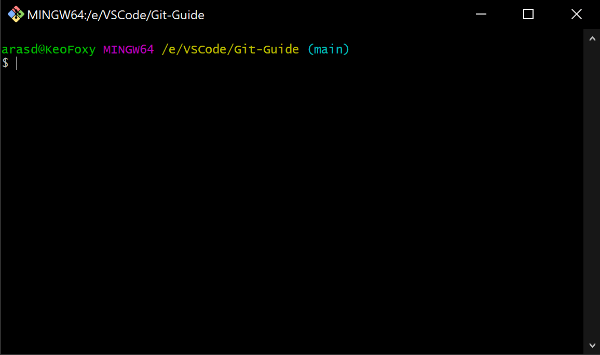  
#
### **_Commit_**
Коммит фиксирует изменения в вашем репозитории, эти изменения будут зафиксированы и Git не будет их менять. После того, как вы сделали коммит, вы отправите его на GitHub.  
К каждому коммиту пишите осмысленные комментарии. По этим комментариям вам в будущем будет проще искать изменения в проекте.
#
### **_Переход в папки_**
[**Статья по работе с командой cd**](https://comp-security.net/%D0%BA%D0%B0%D0%BA-%D0%BF%D0%B5%D1%80%D0%B5%D0%B9%D1%82%D0%B8-%D0%B2-%D0%BF%D0%B0%D0%BF%D0%BA%D1%83-%D0%B8%D0%BB%D0%B8-%D0%BD%D0%B0-%D0%B4%D1%80%D1%83%D0%B3%D0%BE%D0%B9-%D0%B4%D0%B8%D1%81%D0%BA/)  
#
